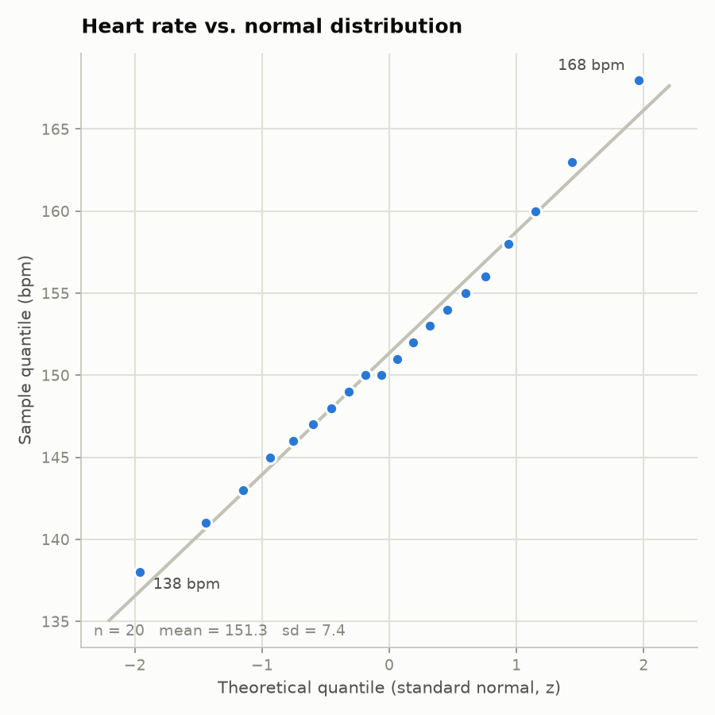
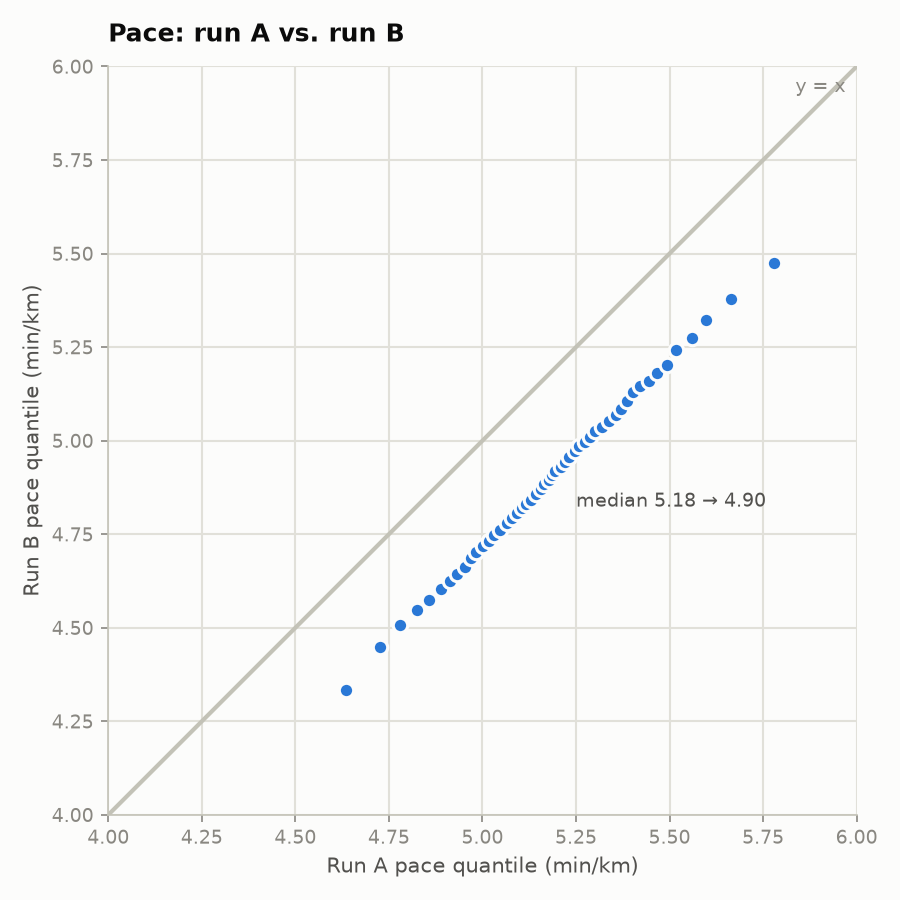

# Quantile-quantile (Q-Q) plot

A Q-Q plot answers one question: **do two distributions have the same shape?**
It does this by sorting both sets of values and plotting the k-th smallest of
one against the k-th smallest of the other. If the shapes match, the points
line up on a straight line. Any bend, kink, or offset in the points shows
exactly *where* and *how* the two distributions differ.

There are two common flavours, and this folder produces one of each:

| File | What is compared |
|---|---|
| `qq_normal.png` | one sample (20 heart-rate readings) vs. the theoretical normal distribution |
| `qq_two_sample.png` | two samples against each other (per-second pace from run A vs. run B) |

Run `python qq_plot.py` to regenerate both (needs `numpy` and `matplotlib`).

## 1. One sample vs. a theoretical distribution

### The data

Twenty heart-rate readings (bpm), one per minute, from a steady run:

```
138 141 143 145 146 147 148 149 150 150
151 152 153 154 155 156 158 160 163 168
```

Mean 151.3, standard deviation 7.4.

### How each point is built

1. **Sort the sample.** The sorted values *are* the sample quantiles. The
   smallest value (138) is the 1st of 20, the largest (168) is the 20th.
2. **Give each rank a probability.** For the i-th of n values use the
   plotting position `p = (i - 0.5) / n`. The 1st of 20 gets p = 0.025,
   the 10th gets 0.475, the 20th gets 0.975. (Not 0 and 1, because the
   normal distribution has no finite 0th or 100th percentile.)
3. **Look up the theoretical quantile.** Ask the standard normal
   distribution "what z-score has this much probability below it?" That
   is the inverse CDF, `NormalDist().inv_cdf(p)` in the Python standard
   library.
4. **Plot (theoretical z, sample value).**

The full table for this dataset:

| i | p = (i-0.5)/20 | theoretical z | sample bpm |
|--:|--:|--:|--:|
| 1 | 0.025 | -1.96 | 138 |
| 2 | 0.075 | -1.44 | 141 |
| 3 | 0.125 | -1.15 | 143 |
| 4 | 0.175 | -0.93 | 145 |
| 5 | 0.225 | -0.76 | 146 |
| 6 | 0.275 | -0.60 | 147 |
| 7 | 0.325 | -0.45 | 148 |
| 8 | 0.375 | -0.32 | 149 |
| 9 | 0.425 | -0.19 | 150 |
| 10 | 0.475 | -0.06 | 150 |
| 11 | 0.525 | 0.06 | 151 |
| 12 | 0.575 | 0.19 | 152 |
| 13 | 0.625 | 0.32 | 153 |
| 14 | 0.675 | 0.45 | 154 |
| 15 | 0.725 | 0.60 | 155 |
| 16 | 0.775 | 0.76 | 156 |
| 17 | 0.825 | 0.93 | 158 |
| 18 | 0.875 | 1.15 | 160 |
| 19 | 0.925 | 1.44 | 163 |
| 20 | 0.975 | 1.96 | 168 |

### The picture



The grey reference line is `mean + sd * z`, i.e. where the points would sit if
the sample were exactly normal with this mean and spread.

How to read it:

- **Middle of the plot (z between -1 and 1):** the points hug the line, so the
  bulk of the readings behave like a normal distribution.
- **Top right:** the last two points (163 and 168 bpm) sit *above* the line.
  The sample's highest values are larger than a normal distribution would
  predict. That is a heavier right tail, here caused by a short surge near
  the end of the run.
- **Bottom left:** 138 bpm sits slightly below the line, a marginally heavier
  left tail, but only one point, so not much to conclude.

A histogram of 20 values would be too coarse to show this. The Q-Q plot shows
it point by point.

## 2. Two samples against each other

This is the form that matters when comparing two activity files. No theoretical
distribution is needed. Instead, both samples are cut at the same probabilities
(here 50 of them: 0.01, 0.03, ..., 0.99) and each pair of quantiles becomes one
point.

### The data

Per-second pace in min/km from two runs of about 30 to 35 minutes each. Run B
was the same kind of effort as run A but on a flatter route, so it is faster
by roughly 0.3 min/km throughout:

| | samples | median pace | spread (sd) |
|---|--:|--:|--:|
| Run A | 1800 | 5.18 min/km | 0.25 |
| Run B | 2100 | 4.90 min/km | 0.25 |

### The picture



The grey line is `y = x`: if both runs had identical pace distributions, every
point would sit on it.

What the points show:

- **They form a straight line, parallel to y = x.** Same shape, same spread.
  Whatever made run B faster affected every part of the run equally.
- **They sit about 0.3 below the line.** For any percentile you pick, run B's
  pace is ~0.3 min/km faster than run A's at that same percentile. The median
  label makes this concrete: 5.18 became 4.90.

## Cheat sheet for reading any Q-Q plot

| Points look like | Meaning |
|---|---|
| On the reference line | Same distribution |
| Straight, parallel, but shifted | Same shape, different centre (a constant offset) |
| Straight, but steeper or flatter than the line | Same shape, different spread |
| Straight in the middle, curling up at the right end | Heavier right tail than the reference |
| Straight in the middle, curling down at the left end | Heavier left tail |
| S-shape | Both tails heavier (or lighter) than the reference |
| A step or gap | A cluster or a missing range of values, e.g. a paused recording |

## Why this is useful for activity files

Averages hide a lot. Two runs can have the same mean heart rate while one was
steady and the other alternated between easy and hard. A Q-Q plot of the two
heart-rate streams would show that immediately as a line that is flatter in the
middle and steeper at the ends. It is also a good check before applying any
statistic that assumes normality, and it works for any per-sample field in a
FIT, TCX, or GPX file: heart rate, pace, cadence, power, or elevation change.
